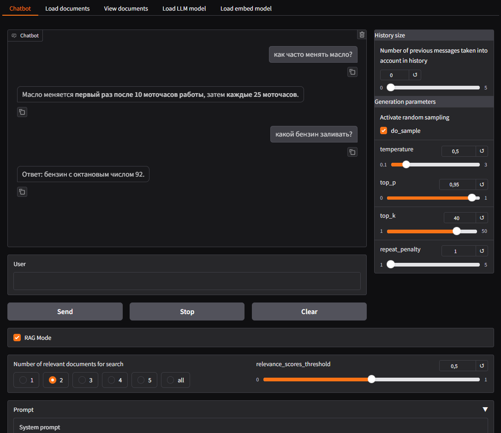

---
# RAG Chatbot with Gradio, llama-cpp-python, and Langchain

<div align="left">

<a href="https://huggingface.co/spaces/sergey21000/chatbot-rag"></a>
</div>

Чат-бот на `llama-cpp-python` и `langchain` с веб-интерфейсом на `Gradio`, использующий механизм RAG для эффективного поиска и генерации ответов

В Google Colab <a href="https://colab.research.google.com/drive/1ZckPUFlRykskJKF5OzwiX82PFcRKNN23"></a> ноутбуке находится код приложения с комментариями вариантах langchain | unstructured + обзор некоторых функций приложения

<details>
<summary>Скриншот главной страницы приложения</summary>


</details>

<a href="https://github.com/sergey21000/chatbot-rag/tree/main/screenshots">Скриншоты</a> интерфейса приложения


---
## 📋 Содержание

- 🚀 [Функционал](#-Функционал)
  - 🧠 [Функционал LLM](#-Функционал-LLM)
  - 📚 [Функционал RAG](#-Функционал-RAG)
- 🛠️ [Стек](#-Стек)
- 🐍 [Установка и запуск через Python](#-Установка-и-запуск-через-Python)
- 🐳 [Установка и запуск через Docker](#-Установка-и-запуск-через-Docker)
  - 🐋 [Запуск через Docker Compose](#-Запуск-через-Docker-Compose)
  - 🏗 [Запуск через Docker](#-Запуск-через-Docker)
  - - 📥 [Запуск контейнера из готового образа](#-Запуск-контейнера-из-готового-образа)
  - - 🔨 [Сборка своего образа и запуск контейнера](#-Сборка-своего-образа-и-запуск-контейнера)


---
## 🚀 Функционал

### 🧠 Функционал LLM

- Обычная генерация ответа с использованием моделей в формате GGUF
- Настройка параметров генерации (`temperature`, `top_k`, `top_p`, `repetition_penalty`)
- Возможность редактировать системный промт (если модель его не поддерживает это будет отображено)
- Выбор количества учитываемых сообщений в истории при подаче запроса пользователя в модель (`History size`, по умолчанию 0 - не учитывать предыдущую историю переписки)
- Выбор и загрузка LLM моделей в формате GGUF из репозиториев HuggingFace с индикацией прогресса загрузки , отображением размера файлов и настройкой [параметров](https://llama-cpp-python.readthedocs.io/en/latest/api-reference/#llama_cpp.Llama.create_chat_completion) `n_gpu_layers` и `n_ctx`
- Отображение используемой ОЗУ и/или видео памяти и используемого места на диске с возможностью очистки от неиспользуемых  Embedding и LLM моделей

### 📚 Функционал RAG

- Генерация ответа с использованием механизма RAG, переключение между режимом обычной генерации и RAG (для активации режима RAG необходимо загрузить документы на вкладке `Load documents`, тогда на странице `Chatbot` появится переключатель режимов)
- Выбор и загрузка Embedding моделей из репозиториев HuggingFace
- Просмотр загруженных текстов из документов
- Отображение полного запроса пользователя, обогащенного контекстом в режиме RAG
- Возможность редактировать шаблон промта при условии контекста
- Поддержка следующих форматов файлов для RAG - `csv doc docx html md pdf ppt pptx txt`, поддержка передачи ссылок на YouTube для загрузки субтитров к видео, выбор языка субтитров
- Настройки загрузки текстов из библиотеки `unstructured` - [загрузка](https://docs.unstructured.io/open-source/core-functionality/partitioning#partition) и деление на чанки и [очистка](https://docs.unstructured.io/open-source/core-functionality/cleaning#clean) текста
- Настройка количества релевантных фрагментов, которые будут обогощать запрос пользователя (параметр `n_results`)
- При установке `n_results` = `all` в контекст будут подаваться абсолютно все фрагменты (это может быть актуально при передачи небольших документов), при установке на `n_results` = `max` будут поданы все найденные фрагметны текста которые превышают `max_distance_treshold`
- Настройка порога для поиска похожих фрагментов текста на запрос пользователя (параметр `max_distance_treshold`, от 0 до 2 по косинусному расстоянию (находить релевантные запросу тексты которые ближе чем это число, чем меньше тем меньше текстов будет находить)

*Загрузка моделей*  
При первом запуске приложения произойдет загрузка модели LLM `google_gemma-3-1b-it-Q8_0.gguf` (1GB) в папку `./models`, а так же загрузка Embedding модели `Alibaba-NLP/gte-multilingual-base` (617MB) в папку `./embed_models`  
Изменить модели можно на страницах приложения `Load LLM model` и `Load embed model`

*Настройка*  
Некоторые базовые параметры по умолчанию можно настроить в `config.py`  

*Проблемы*  
При деплое на удаленных серверах их IP часто оказываются в черных списках YouTube, поэтому загрузка субтитров для всех видео с YouTube будет показывать статус `Invalid video url or current server IP is blocked for YouTube`  
Подробнее в [обсуждении youtube-transcript-api](https://github.com/jdepoix/youtube-transcript-api/issues/303)  


---
## 🛠 Стек

- [python](https://www.python.org/) >= 3.10
- [llama-cpp-python](https://github.com/abetlen/llama-cpp-python) для инференса моделей в формате GGUF
- [gradio](https://github.com/gradio-app/gradio) для написания веб-интерфейса
- [unstructured](https://github.com/Unstructured-IO/unstructured) для загрузки текстовых файлов, разделения текстов на фрагменты 
- [chromadb](https://github.com/chroma-core/chroma) для векторного хранилища 
- [Модель gemma-3-1b](https://huggingface.co/bartowski/google_gemma-3-1b-it-GGUF) `google_gemma-3-1b-it-Q8_0.gguf` в формате GGUF в качестве LLM модели по умолчанию
- [Embedding Модель](https://huggingface.co/Alibaba-NLP/gte-multilingual-base) `Alibaba-NLP/gte-multilingual-base` в качестве Embedding модели по умолчанию

Работоспособность приложения проверялась на Ubuntu 22.04 (python 3.11) и Windows 10 (python 3.12)


---
## 🐍 Установка и запуск через Python

**1) Клонирование репозитория**  

```sh
git clone https://github.com/sergey21000/chatbot-rag.git
cd chatbot-rag
```

**2) Создание и активация виртуального окружения (опционально)**

- *Linux*
  ```sh
  python3 -m venv env
  source env/bin/activate
  ```

- *Windows CMD*
  ```sh
  python -m venv env
  env\Scripts\activate
  ```

- *Windows PowerShell*
  ```powershell
  python -m venv env
  env\Scripts\activate.ps1
  ```

**3) Установка зависимостей**  

- *С поддержкой CPU*
  ```sh
  pip install -r requirements-cpu.txt
  ```

- *С поддержкой CUDA*
  - Linux
    ```sh
    CMAKE_ARGS="-DGGML_CUDA=on" pip install -r requirements-cuda.txt
    ```
  - Windows CMD
    ```sh
    set CMAKE_ARGS=-DGGML_CUDA=on
    pip install -r requirements-cuda.txt
    ```
  - Windows PowerShell
    ```powershell
    $env:CMAKE_ARGS='-DGGML_CUDA=on'
    pip install -r requirements-cuda.txt
    ```

Для установки `llama-cpp-python` на Windows с поддержкой CUDA нужно предварительно установить [Visual Studio 2022 Community](https://visualstudio.microsoft.com/ru/downloads/) и [CUDA Toolkit](https://developer.nvidia.com/cuda-toolkit-archive), как например указано в этой [инструкции](https://github.com/abetlen/llama-cpp-python/discussions/871#discussion-5812096)  

В случае ошибки при установке `llama-cpp-python` воспользоваться поиском по [issue](https://github.com/abetlen/llama-cpp-python/issues), например [issues/1963](https://github.com/abetlen/llama-cpp-python/issues/1963) с командой установки `llama-cpp-python` на Windows 11

Инструкции по установке [llama-cpp-python](https://github.com/abetlen/llama-cpp-python?tab=readme-ov-file#installation-configuration) и [torch](https://pytorch.org/get-started/locally/#start-locally) для других версий и систем

**4) Запуск сервера Gradio**  
```sh
python3 app.py
```
После запуска сервера перейти в браузере по адресу http://localhost:7860/  
Приложение будет доступно через некоторое время (после первоначальной загрузки моделей)

Запуск тестов
```
pytest -vs
```


---
## 🐳 Установка и запуск через Docker

> [!NOTE]  
Для запуска приложения с поддержкой GPU CUDA необходима установка [NVIDIA Container Toolkit](https://docs.nvidia.com/datacenter/cloud-native/container-toolkit/latest/install-guide.html#installation).

### 🐋 Запуск через Docker Compose

**1) Клонирование репозитория**  
```sh
git clone https://github.com/sergey21000/chatbot-rag.git
cd chatbot-rag/docker
```

**2) Запуск Compose из готового образа**

*Запуск с поддержкой CPU*
```sh
docker-compose up -f compose.run.cpu.yml
```

*Запуск с поддержкой CUDA*
```sh
docker-compose up -f compose.run.cuda.yml
```

Веб-интерфейс сервера доступен по адресу  
http://127.0.0.1:7860/  


**2) Запуск Compose со сборкой образа**

*Запуск с поддержкой CPU*
```sh
docker-compose up -f compose.run.cpu.yml
```

*Запуск с поддержкой CUDA*
```sh
docker-compose up -f compose.run.cuda.yml
```
При первом запуске будет произведена сборка образа на основе `Dockerfile-cpu` или `Dockerfile-cuda`

Веб-интерфейс сервера доступен по адресу  
http://127.0.0.1:7860/  

---
<ins><b>Дополнительно</b></ins>

Можно заранее указать файл `compose` по умолчанию и запускать короткой командой
```sh
# установка переменной окружения (вариант для Linux)
export COMPOSE_FILE=compose.run.cpu.yml

# установка переменной окружения (вариант для Windows PowerShell)
$env:COMPOSE_FILE = "compose.run.cpu.yml"

# запуск короткой командой
docker-compose up
```


## 🏗 Запуск через Docker

### 📥 Запуск контейнера из готового образа

- *С поддержкой CPU*
  ```sh
  docker run -it -p 7860:7860 \
	-v ./embed_models:/app/embed_models \
	-v ./models:/app/models \
	--name chatbot-rag \
	ghcr.io/sergey21000/chatbot-rag:main-cpu
  ```

- *С поддержкой CUDA*
  ```sh
  docker run -it --gpus all -p 7860:7860 \
	-v ./embed_models:/app/embed_models \
	-v ./models:/app/models \
	--name chatbot-rag \
	ghcr.io/sergey21000/chatbot-rag:main-cuda
  ```

Для проброса своего конфига в контейнер добавить `-v ./config.py:/app/config.py`


### 🔨 Сборка своего образа и запуск контейнера

**1) Клонирование репозитория**  

```sh
git clone https://github.com/sergey21000/chatbot-rag.git
cd chatbot-rag
```

**2) Сборка образа и запуск контейнера**

- *С поддержкой CPU*

  Сборка образа
  ```sh
  docker build -t chatbot-rag:cpu -f docker/Dockerfile-cpu .
  ```
  Запуск контейнера
  ```sh
  docker run -it -p 7860:7860 \
	-v ./embed_models:/app/embed_models \
	-v ./models:/app/models \
	--name chatbot-rag \
	chatbot-rag:cpu
  ```

- *С поддержкой CUDA*

  Сборка образа
  - Сборка образа на основе образа Nvidia
  ```sh
  docker build -t chatbot-rag:nvidia-cuda -f docker/Dockerfile-cuda-nvidia .
  ```
  - Сборка образа на основе образа Pytorch
  ```sh
  docker build -t chatbot-rag:pytorch-cuda -f docker/Dockerfile-cuda-pytorch .
  ```
  Запуск контейнера
  ```
  docker run -it --gpus all -p 7860:7860 \
	-v ./embed_models:/app/embed_models \
	-v ./models:/app/models \
	--name chatbot-rag \
	chatbot-rag:pytorch-cuda
  ```

После запуска сервера перейти в браузере по адресу http://localhost:7860/  
Приложение будет доступно через некоторое время (после первоначальной загрузки моделей)

Для проброса своего конфига в контейнер добавить `-v ./config.py:/app/config.py`

---

Приложение создавалось для тестирования LLM моделей с использованием RAG как любительский проект  
Оно написано для демонстрационных и образовательных целей и не предназначалось / не тестировалось для промышленного использования


## Лицензия

Этот проект лицензирован на условиях лицензии [MIT](./LICENSE).
