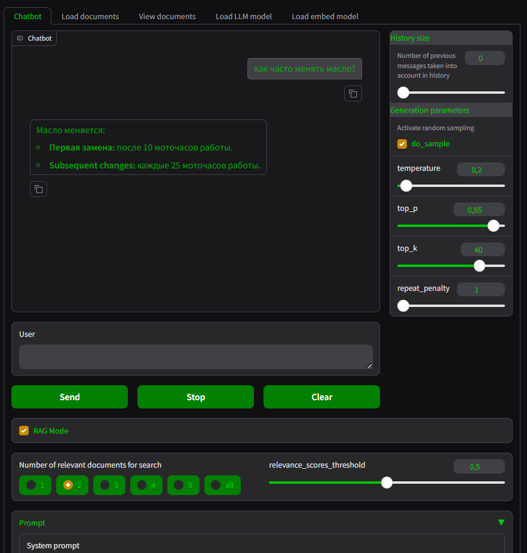
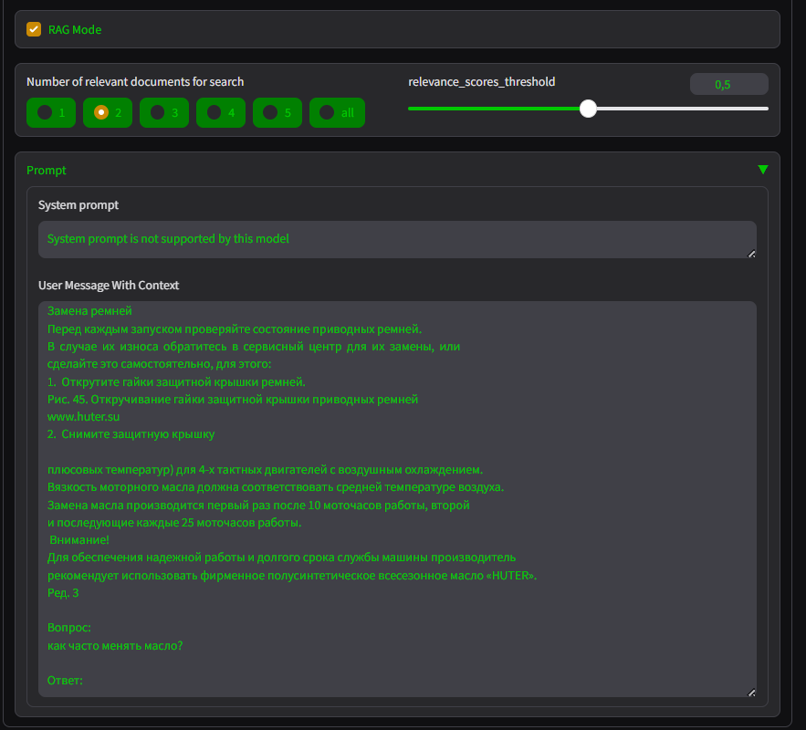
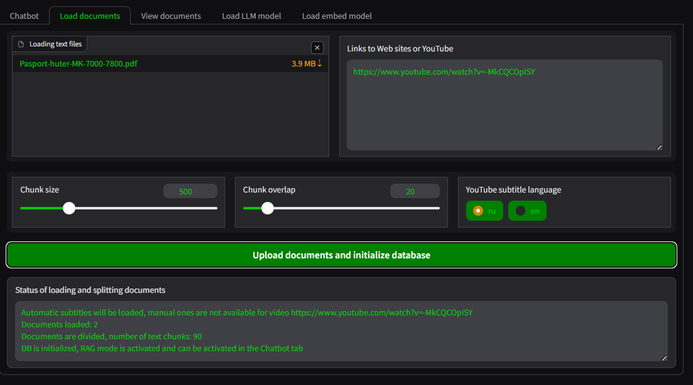
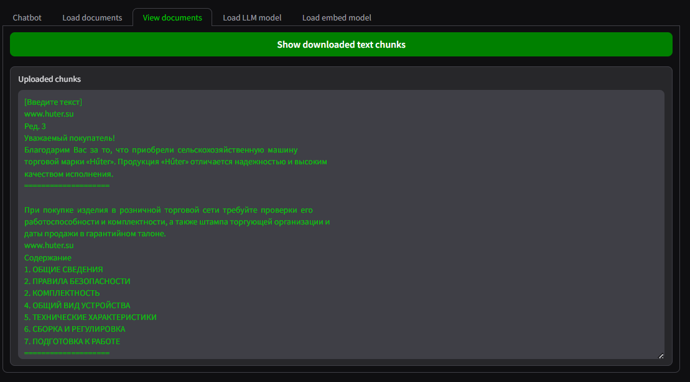
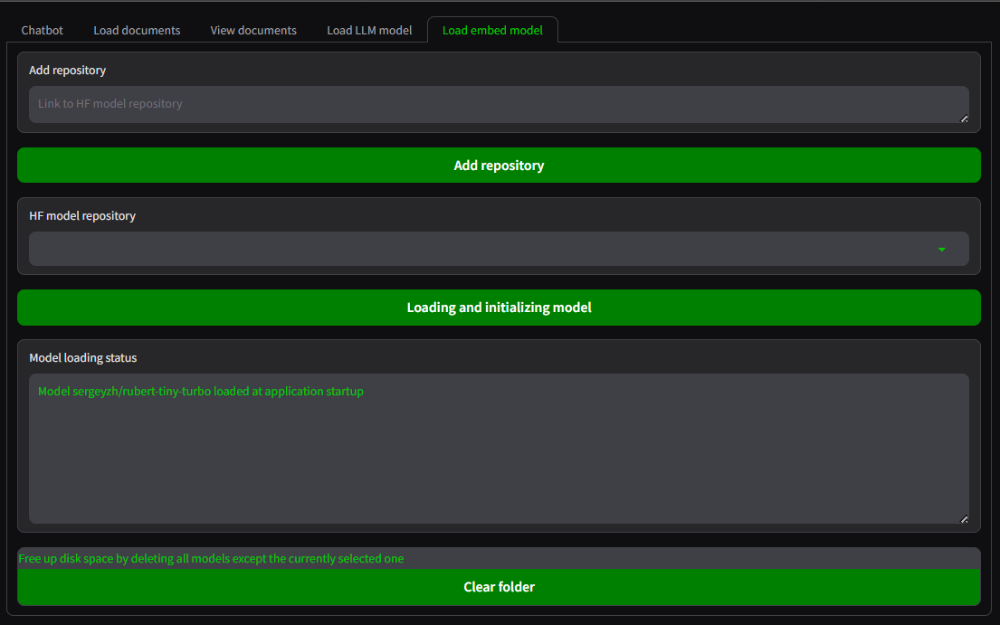
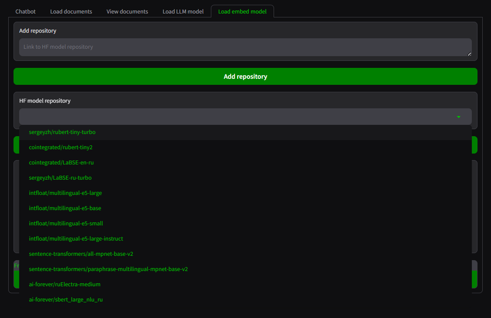
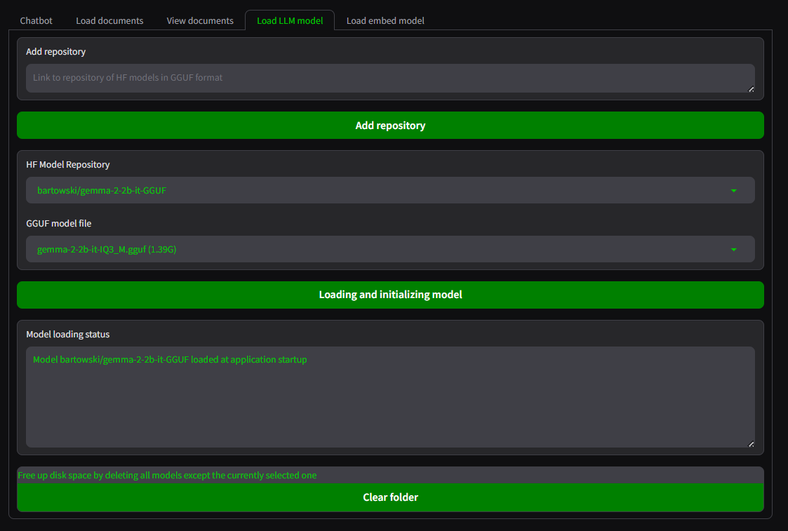
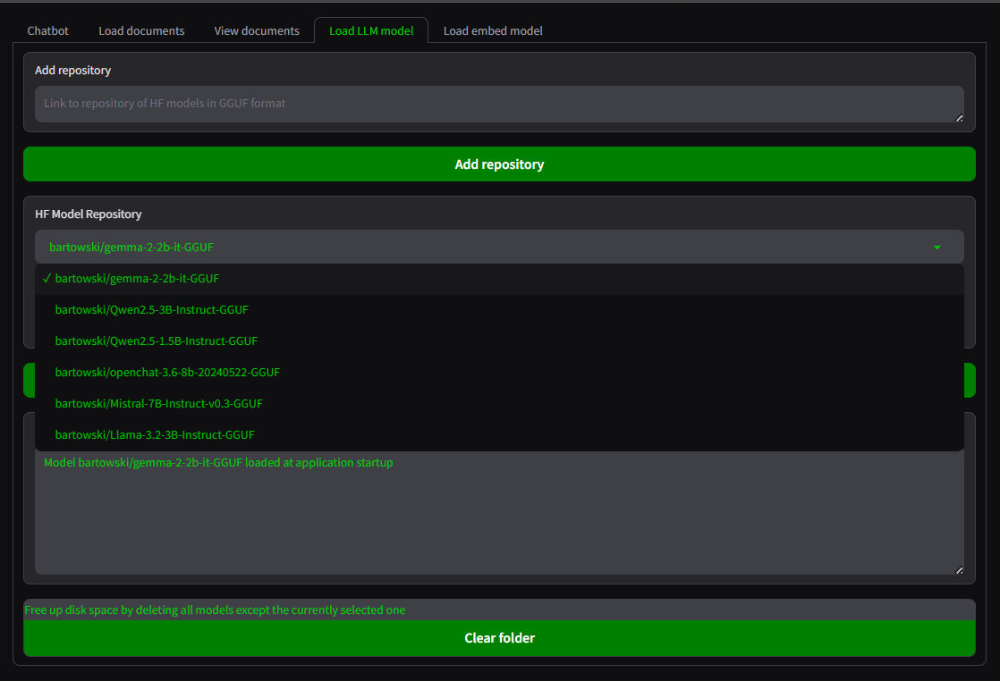
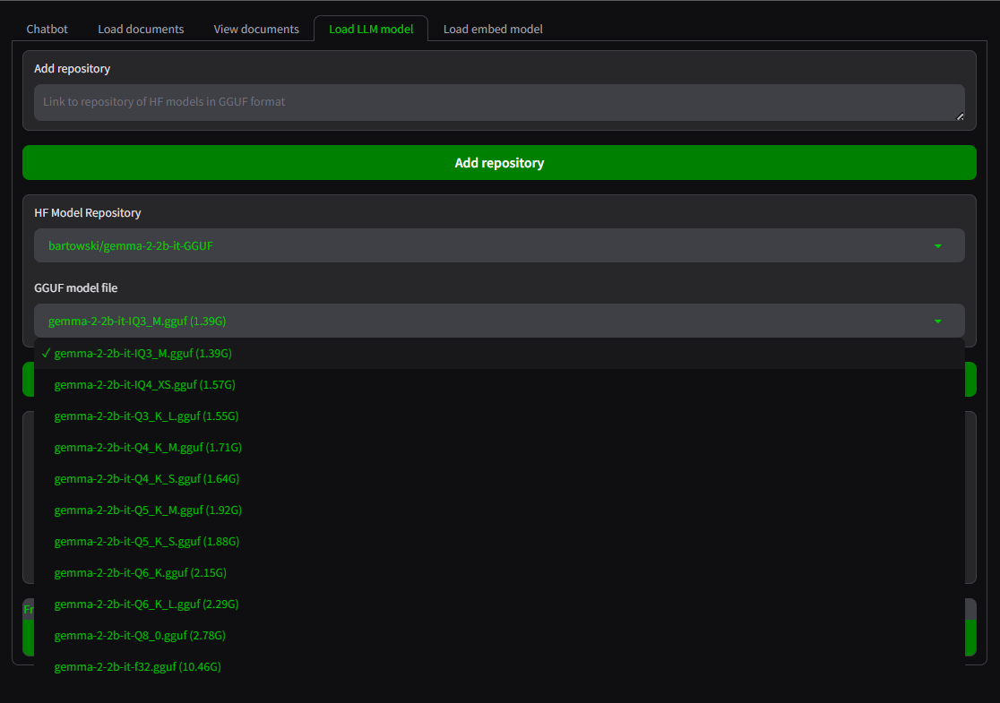

### Скриншоты интерфейса приложения

---
Главная страница приложения - RAG запрос с загруженной документацией по [мотокультиватору](https://huter.ru/userfiles/Паспорта/Мотокультиваторы/Pasport-huter-MK-7000-7800.pdf) с LLM моделью `gemma-2-2b-it-Q8_0.gguf` и Embedding моделью `sergeyzh/rubert-tiny-turbo`

---
Главная страница приложения - продолжение предыдущего скриншота - отображение обогащенного контекстом запроса пользователя

---
Страница загрузки документов для RAG

---
Страница отображения загруженных фрагментов текста

---
Страница загрузки Embedding моделей

---
Страница загрузки Embedding моделей - выбор репозитория HF

---
Страница загрузки LLM моделей

---
Страница загрузки LLM моделей - выбор репозитория HF с моделями GGUF

---
Страница загрузки LLM моделей - выбор модели GGUF из выбранного выше репозитория

